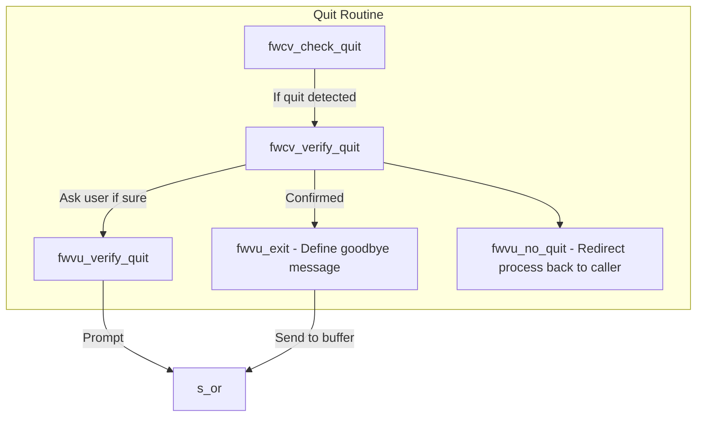

```mermaid
flowchart TD
    subgraph s_qr[Quit Routine]
    H[fwcv_check_quit] 
    L[fwcv_verify_quit] 
    M[fwvu_verify_quit] 
    N[fwvu_exit - Define goodbye message]
    O[fwvu_no_quit - Redirect process back to caller]
    end

    H -- If quit detected --> L
    L -- Ask user if sure --> M
    M -- Prompt --> s_or
    N -- Send to buffer --> s_or
    L -- Confirmed --> N
    L --> O
```
